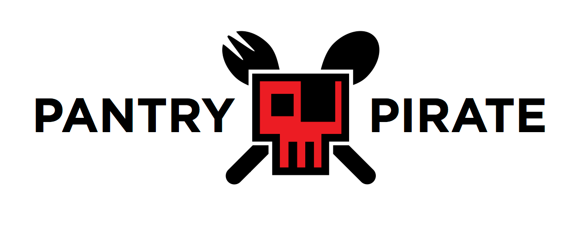
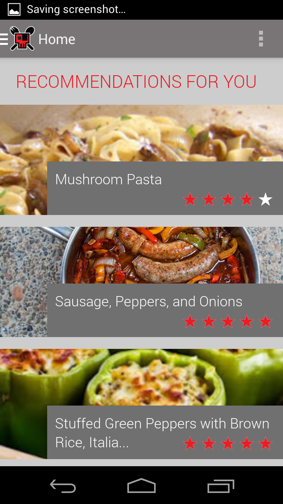
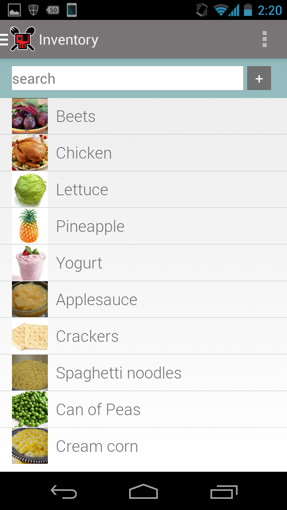
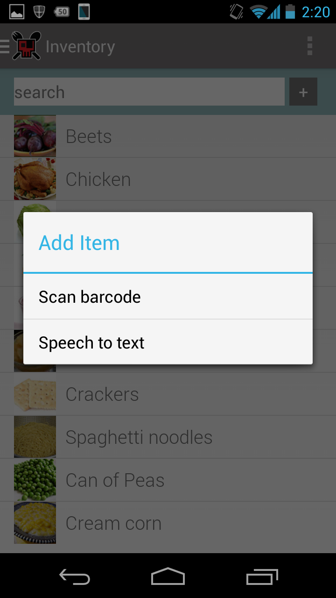
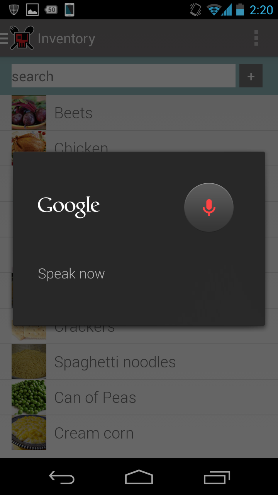
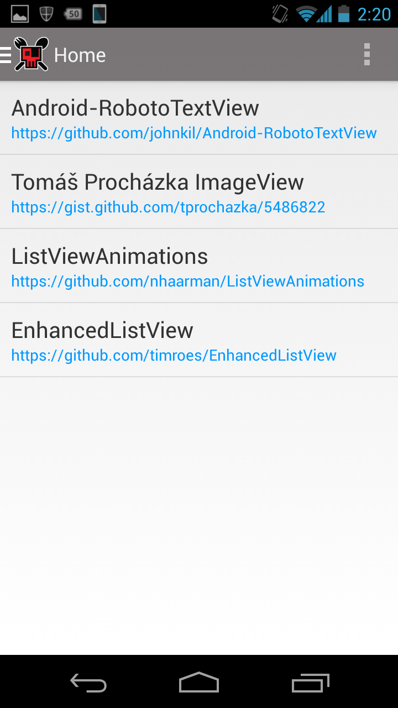

[PantryPirate](https://github.com/levibostian/PantryPirate)
===========================================================

  
Logo designed by [Brian Rupert](http://brianrupert.com/)

### Pantry Pirate is the result of a small dedicated team looking to create a start-up business in one weekend. 

[Startup Weekend Cedar Rapids, IA](http://cedarrapids.startupweekend.org/)  
February 28 - March 2, 2014

Team (from left to right): 
* Gabe Whitters - marketing whiz.
* [Brian Rupert](http://brianrupert.com/) - designer, front-end web developer extraordinaire.
* [Mike Wisniewski](www.linkedin.com/pub/mike-wisniewski/47/3a2/b23) - idea founder. marketing head.
* [Levi Bostian](https://github.com/levibostian) - programmer. makes ideas come to reality.

[Pantry Pirate on Facebook](https://www.facebook.com/PantryPirate)
[Pantry Pirate on Twitter](https://twitter.com/PantryPirate)

## About  

Can't decide what to cook? Pantry Pirate is a mobile app that helps you scrounge together delicious dishes based on the food you already have in your pantry.

Have one ingredient laying around you have no idea what you can make with it? Pantry Pirate provides recipes that lonesome may used for before it may expire.

## Technical details

This PantryPirate source code repo is for the prototype app created to present to the start-up weekend judges at the end of the competition. It is not meant to be fully funtional, (it is able to add items to inventory dynamically, but all other content is static) but only used for demonstration purposes for the start-up weekend. 

  
Homescreen used to present user with recipes they are able to create with the items currently inside of the app's inventory. Uses [ListViewAnimations](https://github.com/nhaarman/ListViewAnimations) to present an appealing list with delicious recipes. 

  
Inventory screen lists all food items in the kitchen ready to be used for recipe creation. Swipe any item off of the screen with [EnhancedListView](https://github.com/timroes/EnhancedListView) to remove the item from inventory. 

  
Pantry Pirate allows user to add items to the app's inventory after purchasing groceries in an automated manner by either scanning food item bar code, or verbally saying the name of the food item hands-free!  
  
Speech to text ability of adding items works to where items are added to the inventry list. Verbally say the name of the food item you would like to add to the inventory then say "Done" to add all of the previously announced items to the inventory. 

Barcode scanning is almost completely working in the prototype. PantryPirate uses [searchupc.com](searchupc.com) as the API to convert the API code to the name of the food item. All is working, but the returned JSON text from the API uses integer values for the arrays instead of string values so deserializing is not possible without a custom deserializing mapper with Retofit but we simply ran out of time to complete this in the weekend time frame.

I want to thank all of the open source projects used to make this app a reality. Without the wonderful open programming community, this demonstration simply could not have been completed. Thank you!  

* [Android-RobotoTextView](https://github.com/johnkil/Android-RobotoTextView)
* [Tomáš Procházka ImageView](https://gist.github.com/tprochazka/5486822)
* [ListViewAnimations](https://github.com/nhaarman/ListViewAnimations)
* [EnhancedListView](https://github.com/timroes/EnhancedListView)
* [Retrofit](https://square.github.io/retrofit/)